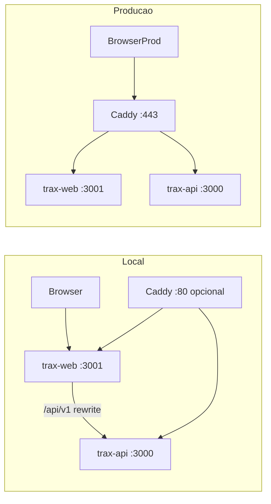

# Ambientes — Trax

O Trax opera em dois ambientes com a mesma arquitetura multi-tenant, diferindo apenas domínios, URLs e infraestrutura.

## Arquitetura

## Mapa de URLs

| Função | Local (direto) | Local (Caddy) | Produção |
|--------|------------------|---------------|----------|
| Landing | http://localhost:3001 | http://localhost | https://traxsolucoes.com.br |
| Super-admin | http://admin.localhost:3001 | http://admin.localhost | https://admin.traxsolucoes.com.br |
| Agência `{slug}` | http://{slug}.localhost:3001 | http://{slug}.localhost | https://{slug}.traxsolucoes.com.br |
| API | http://localhost:3000/api | http://api.localhost/api | https://api.traxsolucoes.com.br/api |
| Swagger | http://localhost:3000/api/docs | idem | desabilitado |

Browsers modernos resolvem `*.localhost` para `127.0.0.1` sem editar `/etc/hosts`.

## Portas padrão

| Serviço | Porta | Variável |
|---------|-------|----------|
| API (NestJS) | 3000 | `APP_PORT` / `TRAX_API_PORT` |
| Web (Next.js) | 3001 | `TRAX_WEB_PORT` |
| PostgreSQL | 5432 | `POSTGRES_PORT` |
| Redis | 6379 | `REDIS_PORT` |
| PgAdmin (opcional) | 5050 | `PGADMIN_PORT` |
| Caddy local (opcional) | 80 | — |

## Variáveis de domínio

| Variável | Local | Produção |
|----------|-------|----------|
| `TRAX_BASE_DOMAIN` | `localhost` | `traxsolucoes.com.br` |
| `NEXT_PUBLIC_TRAX_BASE_DOMAIN` | `localhost` | `traxsolucoes.com.br` |
| `NEXT_PUBLIC_BASE_DOMAIN` | `localhost` | `traxsolucoes.com.br` |
| `WEB_APP_URL` | `http://localhost:3001` | `https://traxsolucoes.com.br` |
| `API_PUBLIC_URL` | `http://localhost:3000` | `https://api.traxsolucoes.com.br` |
| `API_URL` | `http://localhost:3000` | `http://api:3000` (interno Docker) |

## Arquivos de configuração

| Arquivo | Uso |
|---------|-----|
| `.env.example` | Template **local** — copiar para `.env` |
| `.env.production.example` | Template **produção** — copiar no servidor |
| `.env` | Valores reais (gitignored) |
| `Caddyfile.dev` | Proxy local opcional (porta 80) |
| `Caddyfile` | Produção (TLS + roteamento) |
| `docker-compose.yml` | Infra local (Postgres, Redis, Caddy dev) |
| `docker-compose.prod.yml` | Stack completa de produção |

## Roteamento por host

A lógica de subdomínios está centralizada em:

- Frontend: `trax-web/src/lib/domains.ts` + `trax-web/src/middleware.ts`
- Backend: `trax-api/src/common/config/domains.ts` + `tenant.middleware.ts`

| Host | Comportamento |
|------|---------------|
| Domínio raiz (`localhost`, `traxsolucoes.com.br`) | Landing page |
| `admin.{base}` | Painel super-admin (`/admin-panel/*`) |
| `{slug}.{base}` | Dashboard da agência |
| `api.{base}` (via Caddy local) | API direta |

## Próximos passos

- [Desenvolvimento local](./local-development.md)
- [Deploy em produção](./production.md)
